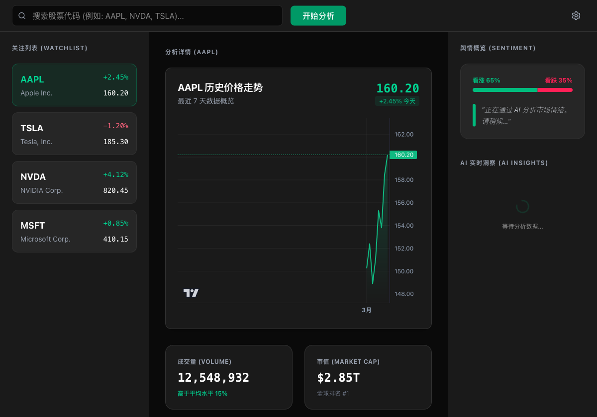

# StockAI

[English](./README.md) | [简体中文](./README.zh-CN.md)



StockAI is a modern cross-platform desktop application built with **Tauri 2.0**. It leverages AI technology to perform deep sentiment analysis and scoring on real-time stock news, providing investors with data-driven insights.

## 🌟 Key Features

- **Multi-source News Scraping**: Automatically collects real-time stock news from Google Finance and Yahoo Finance, with full support for US stocks and Chinese A-shares (Shanghai, Shenzhen, and Beijing Stock Exchange).
- **Deep AI Analysis**: Supports OpenAI (GPT-4o), Anthropic (Claude 3.5 Sonnet), DeepSeek (DeepSeek Chat), and Ollama (local models). Each provider keeps its own API key / base URL / model; switch active provider via a dropdown. Deep Mode extracts full article content for richer analysis; disable it for faster results.
- **Editable Watchlist**: Add and remove stocks freely — the list persists across sessions via local storage.
- **Modern UI Design**: Features a Glassmorphism design language with immersive settings management and real-time analysis progress feedback.
- **Local-first**: All API configurations and personalized settings are securely stored locally, never leaving your device.

## 🏗️ Architecture Overview

1.  **Frontend (UI Layer)**: React 19 + TypeScript + Vite. Responsible for view rendering and user interaction.
2.  **Core Orchestration (Tauri Core)**: Rust. Manages local persistence, system integration, and Sidecar process scheduling.
3.  **Analysis Engine (Sidecar)**: Based on the Bun runtime. Uses Playwright for web scraping and integrates AI models for text processing.

## 📦 Installation

Pre-built binaries are available on the [Releases](https://github.com/hyhmrright/StockAI/releases/latest) page.

### macOS — "StockAI is damaged" error

macOS Gatekeeper blocks apps that aren't notarized by an Apple Developer certificate. Run this command in Terminal to remove the quarantine flag:

```bash
xattr -cr /Applications/StockAI.app
```

Then open the app normally. This is safe — the app contains no network backdoors and the full source code is auditable in this repository.

> **Why this happens:** Apps downloaded from the internet receive a quarantine attribute. Without an Apple code-signing certificate, macOS shows "damaged" instead of the usual "unknown developer" prompt.

### Windows — SmartScreen warning

Click **More info → Run anyway**. This appears for any unsigned executable.

### Linux (.deb)

```bash
sudo dpkg -i StockAI_*_amd64.deb
```

Requires WebKitGTK (pre-installed on most GNOME-based distros).

---

## 🚀 Quick Start

### Prerequisites

- **Bun**: Primary package manager and Sidecar runtime. [Install Bun](https://bun.sh/)
- **Rust**: For building the Tauri core. [Install Rust](https://www.rust-lang.org/)
### 1. Install Dependencies

```bash
# Install all dependencies using Bun
bun install
```

### 2. Prepare Sidecar Binaries

Tauri's Sidecar mechanism requires specifically named binaries. Compile the Sidecar before running:

```bash
# macOS ARM64 (Apple Silicon)
bun build sidecar/index.ts --compile --outfile sidecar/stockai-backend-aarch64-apple-darwin

# Windows x86_64
bun build sidecar/index.ts --compile --outfile sidecar/stockai-backend-x86_64-pc-windows-msvc.exe

# Linux x86_64
bun build sidecar/index.ts --compile --outfile sidecar/stockai-backend-x86_64-unknown-linux-gnu
```

### 3. Start Development Environment

```bash
bun tauri dev
```

## 🧪 Testing

The project uses a multi-layered testing system:

- **Frontend Tests (Vitest)**: `bunx vitest run`
- **Sidecar Logic Tests (Bun)**: `cd sidecar && bun test`
- **Rust Core Tests (Cargo)**: `cd src-tauri && cargo test`
- **Integrated Smoke Test**: `bun scripts/smoke-test.ts`

## 🛠️ Tech Stack

- **Desktop Framework**: Tauri 2.0 (Rust)
- **Frontend Framework**: React 19, TailwindCSS 4, Lucide Icons, Lightweight Charts
- **Scraper/Backend**: Bun, Playwright, NodeHtmlMarkdown
- **AI Integration**: OpenAI SDK, Anthropic SDK, Ollama SDK (DeepSeek via OpenAI-compatible API)

## 📅 Development Conventions

- **Code Comments**: All logic comments must use **Chinese** (as per project preference).
- **Architecture Principles**: Strictly follow Clean Architecture with unidirectional dependency flow (UI -> Core -> Sidecar).
- **Test Driven**: All parsing logic must be verified by offline unit tests.

## 📄 License

MIT License

