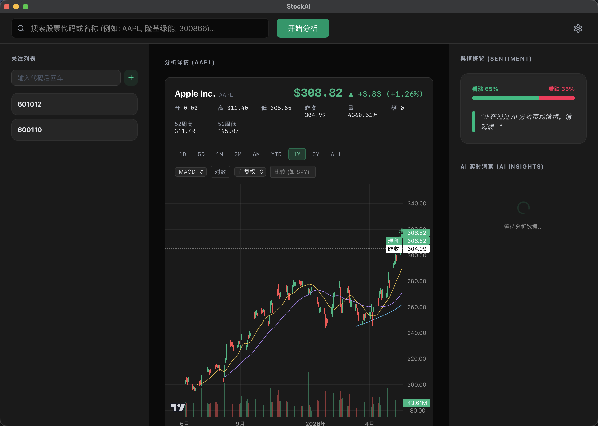

# StockAI (简体中文)

[English](./README.md) | [简体中文](./README.zh-CN.md)

[](./LICENSE)
[](https://github.com/hyhmrright/StockAI/releases/latest)
[](https://github.com/hyhmrright/StockAI/releases)
[](https://github.com/hyhmrright/StockAI/stargazers)
[](https://github.com/hyhmrright/StockAI/releases/latest)



**一个跑在你自己电脑上的 AI 投研工作台。** StockAI 汇集美股与 A 股的实时新闻、行情、财务与资金流，再在其上叠加 AI：一次快速的情绪研判、13 位投资大师各按自己的框架给出的独立判断，以及一个能带原文引用回答提问的对话窗口。基于 **Tauri 2** 构建——单个桌面程序，无服务端，API Key 不出本机。

> **自带模型。** OpenAI、Anthropic、DeepSeek、GLM，或者完全本地的 Ollama。本项目不托管任何模型，也不做任何中转。

## 🌟 核心特性

### 🧠 三个深度的 AI 分析

- **情绪速览**：抓取该标的近期新闻，给出看涨 / 看跌比例与利多、风险因素卡片。开启深度模式则抽取正文全文，而不只看标题。
- **大师深度分析**：13 位投资大师 Agent（巴菲特、芒格、格雷厄姆、伯里、伍德、林奇、费雪、阿克曼、帕伯莱、塔勒布、德鲁肯米勒、达摩达兰、金君瓦拉），每位是一次独立 LLM 调用、携带该投资人真实的分析框架，再由聚合器合成共识评级，可逐位展开看各自的理由。跑哪几位由你勾选，面板会在**花钱之前**先告诉你这次要调用多少次 LLM。
- **问财报**：对话面板以该公司的财报、刚抓到的新闻与屏幕上的量化指标为依据作答，每条回答都带可点回原文的引用。

**分析永远不会自己触发。** 切换股票只加载行情，不消耗任何 token——每一次 LLM 调用都由你点出来。模型可按角色分配，便宜的模型做摘要，强的模型做推理。

### 📊 量化评分、选股与回测

- **量化评分（1–100）**：技术面 + 基本面加权为基准，融合估值方向，再按波动率向中性收敛。某个维度取不到时会降级为更弱的结论，而不是编一个数出来。
- **自然语言选股**：直接输入「主板 A 股里 ROE 高于 15%、市盈率低于 20 的」，它会解析条件、扫全 A 股市场，再为靠前的候选补拉基本面。动手之前会先把「我是这么理解你这句话的」摆给你看。
- **策略回测**：在已加载的历史上跑策略，给出总收益、年化收益、交易次数与买入持有基准，买卖点与净值曲线直接画在图上。
- **大师历史战绩**：每位大师给出的方向性判断都会记在本地并按现价盯市，命中率与等权净值曲线从你第一次分析那天起向前累积。

### 📈 图表与行情

- **交互式 K 线图**：MA / BOLL 主图叠加，九档周期（1D / 5D / 1M / 3M / 6M / YTD / 1Y / 5Y / All），副图指标可切换（MACD / RSI / KDJ / OBV / VWAP），支持对数坐标、前 / 后复权、对比基准叠加，交易时段实时价合并进最后一根 K 线。
- **大盘视角**：顶部常驻指数条（上证 / 深证 / 创业板 / 标普 500 / 纳斯达克 / 道琼斯），点开即是行业与概念板块涨幅榜（含主力净流入、涨跌家数、领涨股），以及**龙虎榜**——最新交易日净买入 / 净卖出前十，附上榜原因。
- **公司资料（F10，A 股）**：公司概况、最新报告期主营构成（按产品 / 行业 / 地区，含毛利率）、股东户数与十大流通股东、所属板块。默认收起，展开才拉取。

### 💼 你自己的账本

- **我的持仓**：记录真实持仓（份额 + 加权平均成本），实时市值、浮动盈亏、当日盈亏与仓位占比一目了然；加仓自动按份额加权合并成本。**不同币种分开汇总**——本应用没有汇率数据源，人民币与美元强行相加只会得到一个无意义的数字；取不到报价的标的一律排除并显式点名，绝不用 0 顶替。
- **关注列表与价格提醒**：侧边栏输入框快速增删，可为任意标的设上 / 下限价格提醒，触发时走系统通知。
- **分析历史**：每一次分析、深度分析与选股都归档进本地 SQLite，随时可完整回看。

### ⚙️ 为「一直能用」而设计

- **数据源冗余**：报价、K 线、基本面、板块榜、资金流、全市场快照各自在腾讯 / 东财 / 新浪 / Yahoo 之间依次回退，单一上游故障不会让界面整块空白。新闻在 Google 与 Yahoo 都不可达的网络环境下同样能用——东财资讯这一路不依赖这两个域名。
- **本地优先，密钥安全**：设置与 API Key 存在系统级 store；Key 通过 `0600` 权限的临时文件交给分析进程，绝不经命令行参数传递——那会在任何进程列表里裸奔。
- **三语界面**：简体中文 / English / 日本語，运行时可切换，并一路传递到 LLM 的提示词里。
- **应用内自动更新**：v0.15.0 及以上版本自动升级，更新包带签名校验。

## 🏗️ 架构概览

三层，依赖严格单向：**UI → Tauri Core (Rust) → Sidecar (Bun)**。

1. **前端（`src/`）**：React 19 + TypeScript + Vite。所有 IPC 收敛到单一入口；本地历史经 `tauri-plugin-sql` 存入 SQLite。
2. **Tauri Core（`src-tauri/`）**：Rust。只暴露一个命令 `invoke_sidecar`，它不认识任何业务——只负责把哨兵替换成临时文件路径（配置、超大 payload）并善后清理。因此新增能力无需改 Rust。
3. **Sidecar（`sidecar/`）**：编译后的 Bun 二进制，每次调用现起、完全无状态。负责抓新闻（纯 `fetch` 策略优先，扑空了才启 Playwright）、跑量化计算、对接各家 AI provider。

`shared/` 是三层唯一的共享来源：DTO 类型、CLI 动作清单、provider 默认档案与市场识别。

完整契约见 [`.claude/rules/architecture.md`](./.claude/rules/architecture.md)。

## 📦 安装

预构建安装包在 [Releases](https://github.com/hyhmrright/StockAI/releases/latest) 页面下载。

装好后打开应用 → 右上角**设置** → 填入所用 provider 的 API Key → 保存即可开始。

### macOS — 提示「已损坏，无法打开」

这是 macOS Gatekeeper 拦截了未经 Apple 公证的 app，并非真的损坏。在终端运行以下命令解除隔离属性：

```bash
xattr -cr /Applications/StockAI.app
```

之后正常打开即可。这是安全的——app 不含任何后门，完整源代码在本仓库可审计。

> **原因说明**：从互联网下载的 app 会被 macOS 打上隔离标记（quarantine）。没有 Apple 开发者证书时，系统会显示「已损坏」而不是通常的「来自未知开发者」弹窗。

### Windows — SmartScreen 警告

点击**更多信息 → 仍要运行**即可。所有未签名的可执行文件都会触发此提示。

### Linux (.deb)

```bash
sudo dpkg -i StockAI_*_amd64.deb
```

需要 WebKitGTK 运行时（大多数基于 GNOME 的发行版已预装）。

---

## 🚀 从源码构建

### 前置要求

- **Bun**：包管理器与 Sidecar 运行时。[安装 Bun](https://bun.sh/)
- **Rust**：用于构建 Tauri 核心。[安装 Rust](https://www.rust-lang.org/)

### 1. 安装依赖

```bash
bun install
```

### 2. 启动开发环境

```bash
bun tauri dev
```

它会先为当前机器编译 Sidecar 二进制，无需额外步骤。

### 3. 打包正式版

```bash
bun tauri build
```

需要为其他平台单独交叉编译 Sidecar 时：

```bash
BUN_TARGET=bun-windows-x64 bun sidecar/build-script.ts
```

可选目标：`bun-darwin-arm64` · `bun-darwin-x64` · `bun-linux-x64` · `bun-windows-x64`。产物落在 `src-tauri/bin/`，按 Tauri 要求的 Rust 三元组命名。

## 🧪 测试

```bash
bun run test              # 全量离线套件——前端 Vitest + Sidecar Bun test
bun run test:integration  # 上面这些，外加对每个数据源的真网络断言
bun run test:e2e          # 起真浏览器跑 Vite，断言 K 线图确实画得出来
bun run format            # Biome 格式化
cd src-tauri && cargo test # Rust 核心
```

默认套件**完全离线**——抓取与解析解耦，每处网络调用都有注入点。但离线 fixture 永不变化，对上游改版是结构性失明的，所以每个外部数据源另有一条形状断言写在 `*.integration.ts` 里，由 CI 每日兜底。

## 🛠️ 技术栈

- **桌面**：Tauri 2 (Rust)、`tauri-plugin-sql` 接 SQLite、带签名的自动更新
- **前端**：React 19、TailwindCSS 4、Lightweight Charts v5、Lucide Icons
- **Sidecar**：Bun、Playwright、node-html-markdown
- **AI**：OpenAI SDK、Anthropic SDK、Ollama SDK（DeepSeek / GLM 走 OpenAI 兼容协议）
- **工具链**：Biome、Vitest、Lefthook

## 📅 开发规范

- **代码注释**一律使用**中文**。
- **UI 组件文件不超过 200 行**，复杂逻辑抽进 hook。
- **依赖严格单向**（UI → Core → Sidecar），`shared/` 是唯一的跨层来源。
- **解析逻辑与网络层分离**，必须有离线单元测试覆盖。

## 🤝 参与贡献

欢迎贡献！请先阅读[贡献指南](./CONTRIBUTING.md)与[行为准则](./CODE_OF_CONDUCT.md)。发现 bug 或有想法？欢迎提 [issue](https://github.com/hyhmrright/StockAI/issues) 或开 [discussion](https://github.com/hyhmrright/StockAI/discussions)。

## ⚠️ 免责声明

StockAI 是研究与学习工具。其输出——包括 AI 生成的评级、大师共识、量化评分与回测结果——都不构成投资建议。行情数据来自公开第三方源，可能延迟、缺失或出错。投资决策及其后果由你自己承担。

## 📄 开源协议

[MIT](./LICENSE) © hyhmrright
